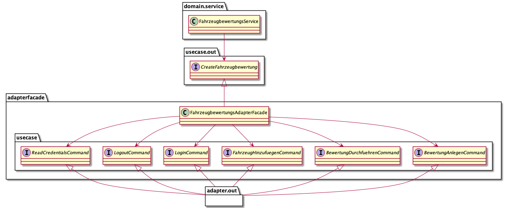

# Flexible Anwendungsarchitektur mit der Clean Architecture - Codebeispiele zur Artikelserie

## Zur Artikelserie

* [Zu Teil 1 in Java Aktuell 2/22](https://www.doag.org/de/home/news/java-aktuell-022022-architektur/)
* [Zu Teil 2 in Java Aktuell 3/22](https://www.doag.org/de/home/news/java-aktuell-3-22-security/)
* [Zu Teil 3 in Java Aktuell 4/22](https://www.doag.org/de/mitmachen/java-aktuell-archiv/zeitschrift/java-aktuell-04-2022-microservices/)

## Hinweis
Der Quellcode hat nur das Ziel, die in der Artikelserie beschriebenen Konzepte zur verdeutlichen. Der Code ist nicht lauffähig.
Der Code sollte kompilieren.

Zur Verdeutlichung der Verwendung von Dependency Injecton wird die  Library [Google Guice](https://github.com/google/guice/wiki/Motivation) eingesetzt.
Google Guice ist nicht vollständig konfiguriert. Auch hier ist das Ziel "nur" den Einsatz der Verwendung zu verdeutlichen.

## Output Adapter Factory Pattern

Am Beispiel des Package Fahrzeug wird das Output Adapter Factory Pattern beschrieben. Der FahrzeugService ist Konsument einer Adapter-Implementierung 
des Package [adapter.out](https://github.com/MatthiasEschhold/clean-architecture-and-flexibility-patterns/tree/main/clean-architecture-and-flexibility-patterns/src/main/java/de/novatec/clean/architecture/fahrzeug/adapter/out). 
Darunter sind die Factory und die beteiligten Adapter-Implementierung abgelegt.

## Service Strategy Pattern

Die Service Strategie ist am Beispiel einer Schnell- und Exaktenbewertung verdeutlicht im Package
[fahrzeugbewertung.strategy](https://github.com/MatthiasEschhold/clean-architecture-and-flexibility-patterns/tree/main/clean-architecture-and-flexibility-patterns/src/main/java/de/novatec/clean/architecture/fahrzeugbewertung/strategy).

## Service Decorator Pattern

Das Service Decorator Pattern wird ebenfalls am Beispiel der Fahrzeugbewertung in Abhängigkeit von drei 
Nutzergruppen beschrieben. Die Implementierung der Dekorierer befindet 
sich im Package 
[fahrzeugbewertung.decorator](https://github.com/MatthiasEschhold/clean-architecture-and-flexibility-patterns/tree/main/clean-architecture-and-flexibility-patterns/src/main/java/de/novatec/clean/architecture/fahrzeugbewertung/decorator).

Ergänzend zu Kapitel 2 ist der FahrzeugbewertungsService als Element des Service Decorator Pattern, 
ebenfalls Konsument des Supporting Services SendEmail.

## Output Adapter Command Facade Pattern

Das Output Adapter Commnd Facade Pattern wird im vgl. zum Artikel detailliert im Package 
[fahrzeugbewertung.facade](https://github.com/MatthiasEschhold/clean-architecture-and-flexibility-patterns/tree/main/clean-architecture-and-flexibility-patterns/src/main/java/de/novatec/clean/architecture/fahrzeugbewertung/facade).
veranschaulicht. Die folgende Abbildung visualisiert das implementierte Beispiel. Die Commands der Fassade
befindet sich im Package 
[fahrzeugbewertung.facade.adapterfacade.usecase](https://github.com/MatthiasEschhold/clean-architecture-and-flexibility-patterns/tree/main/clean-architecture-and-flexibility-patterns/src/main/java/de/novatec/clean/architecture/fahrzeugbewertung/facade/adapterfacade/usecase).
Die Adapterfassade nutzt diese Use Case zur Orchestrierung der fachlichen
Teilfunktionen, abgebildet als Adapter-Implementierung. 
Die Komplexität aufgrund der Interaktion mit dem externen System, befindet sich nicht (direkt) in der Domäne. Dies 
führt zu einem verständlicheren Entwurf, insbesondere wenn die Domäne noch weitere Aufgaben erfüllen muss, wie z.B.
die Kalkulation des durchschnittlichen Marktpreises durch Interaktion mit einem anderen externen System 
[Use Case Out für die kalkultion des durchschnittlichen Marktpreises](https://github.com/MatthiasEschhold/clean-architecture-and-flexibility-patterns/blob/main/clean-architecture-and-flexibility-patterns/src/main/java/de/novatec/clean/architecture/fahrzeugbewertung/facade/usecase/out/CalcuateMarktpreis.java).

## Shared Output Adapter Pattern

Zur beispielhaften Beschreibung des Shared Output Adapter Pattern wird das Geschätfsobjekt Fahrzeug verwendet.
Die Fahrzeugdaten werden von einem externen Service abgefragt wird. Zwei Konsumenten,
das Package
[fahrzeugbewertung.decorator](https://github.com/MatthiasEschhold/clean-architecture-and-flexibility-patterns/tree/main/clean-architecture-and-flexibility-patterns/src/main/java/de/novatec/clean/architecture/fahrzeugbewertung/decorator).
und das Package 
[fahrzeugangebot](https://github.com/MatthiasEschhold/clean-architecture-and-flexibility-patterns/tree/main/clean-architecture-and-flexibility-patterns/src/main/java/de/novatec/clean/architecture/fahrzeugangebot)
benötigen einen unterschiedlichen Umfang der Fahrzeugdaten und führen unabhängige Geschäftslogik auf diesen Daten aus.
Jeder Konsument hat sein Domänenmodell. Der Shared Output Adapter mappt jeweils auf das Domänenmodell
des Konsumenten. Die ausgehenden Use Cases, die der Shared Output Adapter implementiert, gehören 
zu den Konsumenten und sind dort in der Paketstruktur verortet.
* [Shared Output Adapter](https://github.com/MatthiasEschhold/clean-architecture-and-flexibility-patterns/tree/main/clean-architecture-and-flexibility-patterns/src/main/java/de/novatec/clean/architecture/shared/output/adapter/fahrzeug)
* [Use Case Out der Fahrzeugbewertung](https://github.com/MatthiasEschhold/clean-architecture-and-flexibility-patterns/blob/main/clean-architecture-and-flexibility-patterns/src/main/java/de/novatec/clean/architecture/fahrzeugbewertung/decorator/usecase/out/ReadFahrzeugstammdaten.java)
* [Use Case Out des Fahrzeugangebot](https://github.com/MatthiasEschhold/clean-architecture-and-flexibility-patterns/blob/main/clean-architecture-and-flexibility-patterns/src/main/java/de/novatec/clean/architecture/fahrzeugangebot/usecase/out/FetchFahrzeugstammdaten.java)

## Supporting Service Pattern

Das Supporting Service Pattern wird am Beispiel eines Service für den Emailversand beschrieben.

Im Package  
[supporting.service.email](https://github.com/MatthiasEschhold/clean-architecture-and-flexibility-patterns/tree/main/clean-architecture-and-flexibility-patterns/src/main/java/de/novatec/clean/architecture/supporting/service/email)
befindet sich die Klasse EmailService, die das Interface SendMail implementiert. 
SendMail hat dabei den Charakter eines ausgehenden Use Cases und wird vom Domain Service FahrzeugangebotService des Package
[fahrzeugangebot.domain.service](https://github.com/MatthiasEschhold/clean-architecture-and-flexibility-patterns/tree/main/clean-architecture-and-flexibility-patterns/src/main/java/de/novatec/clean/architecture/fahrzeugangebot/domain/service)
sowie vom dem FahrzeugbewertungsService des Package
[fahrzeugbewertung.decorator.domain.service](https://github.com/MatthiasEschhold/clean-architecture-and-flexibility-patterns/tree/main/clean-architecture-and-flexibility-patterns/src/main/java/de/novatec/clean/architecture/fahrzeugbewertung/decorator/domain/service)
verwendet.

## Application Service Pattern

Der Baustein Ersatzteile hat die Aufgabe eine Teileliste zu einem Fahrzeug zu erstellen.
Dabei nutzt das Package 
[ersatzteil](https://github.com/MatthiasEschhold/clean-architecture-and-flexibility-patterns/tree/main/clean-architecture-and-flexibility-patterns/src/main/java/de/novatec/clean/architecture/ersatzteile)
das Package 
[fahrzeug](https://github.com/MatthiasEschhold/clean-architecture-and-flexibility-patterns/tree/main/clean-architecture-and-flexibility-patterns/src/main/java/de/novatec/clean/architecture/fahrzeug)
über den eingehenden Use Case ReadFahrzeug. Die fachliche Beziehung wird über einen 
Application Service (TeilelisteApplicationService) aufgelöst. Dieser ist Abhängig vom Package
[fahrzeug](https://github.com/MatthiasEschhold/clean-architecture-and-flexibility-patterns/tree/main/clean-architecture-and-flexibility-patterns/src/main/java/de/novatec/clean/architecture/fahrzeug)
und dessen Entitäten in 
[fahrzeug.domain.model](https://github.com/MatthiasEschhold/clean-architecture-and-flexibility-patterns/tree/main/clean-architecture-and-flexibility-patterns/src/main/java/de/novatec/clean/architecture/fahrzeug/domain/model). 
Der Kern der Domäne von Teileliste bleibt jedoch unabhängig vom Baustein
Fahrzeug, wenn dies der Application Service überführt in die Entitäten der Domäne von
[ersatzteil.domain.model](https://github.com/MatthiasEschhold/clean-architecture-and-flexibility-patterns/tree/main/clean-architecture-and-flexibility-patterns/src/main/java/de/novatec/clean/architecture/ersatzteile/domain/model).

## Adapter.Out - Usecase.In Pattern

Der FahrzeugangebotService in
[fahrzeugangebot.domain.service](https://github.com/MatthiasEschhold/clean-architecture-and-flexibility-patterns/tree/main/clean-architecture-and-flexibility-patterns/src/main/java/de/novatec/clean/architecture/fahrzeugangebot/domain/service)
enthält die Geschäftslogik für die Erstellung eines rechtsgültigen Angebots
für den Verkauf eines Gebrauchtwagens. Dabei wird der Händlerverkaufswert benötigt. Dieser wird
der im Package Fahrzeugbewertung
([fahrzeugbewertung.decorator](https://github.com/MatthiasEschhold/clean-architecture-and-flexibility-patterns/tree/main/clean-architecture-and-flexibility-patterns/src/main/java/de/novatec/clean/architecture/fahrzeugbewertung/decorator))
berechnet wird. Zur Abbildung der fachlichen Beziehungen zwischen den Bausteinen
wird das Adapter.Out - Usecase.in Pattern eingesetzt.

Im Package
[fahrzeugangebot.adapter.out](https://github.com/MatthiasEschhold/clean-architecture-and-flexibility-patterns/tree/main/clean-architecture-and-flexibility-patterns/src/main/java/de/novatec/clean/architecture/fahrzeugangebot/domain/service) 
befindet sich der AngebotspreisAdapter, der den ausgehenden Use Case CalcualteAngebotspreis des Packages
[fahrzeugangebot.usecase.out](https://github.com/MatthiasEschhold/clean-architecture-and-flexibility-patterns/tree/main/clean-architecture-and-flexibility-patterns/src/main/java/de/novatec/clean/architecture/fahrzeugangebot/usecase/out)
implementiert. Der AngebotspreisAdapter referenziert einen eingehenden Use Case von
[fahrzeugbewertung.decorator.usecase.in](https://github.com/MatthiasEschhold/clean-architecture-and-flexibility-patterns/tree/main/clean-architecture-and-flexibility-patterns/src/main/java/de/novatec/clean/architecture/fahrzeugbewertung/decorator/usecase/in)
der Fahrzeugbewertung und führt über diesen die Kalulation durch. 
Durch das Mapping im Adapter, sind beide Domänen der Package 
[fahrzeugbewertung.decorator](https://github.com/MatthiasEschhold/clean-architecture-and-flexibility-patterns/tree/main/clean-architecture-and-flexibility-patterns/src/main/java/de/novatec/clean/architecture/fahrzeugbewertung/decorator) 
und
[fahrzeugangebot](https://github.com/MatthiasEschhold/clean-architecture-and-flexibility-patterns/tree/main/clean-architecture-and-flexibility-patterns/src/main/java/de/novatec/clean/architecture/fahrzeugangebot) 
technisch voneinander unabhängig und maximal möglich entkoppelt.
